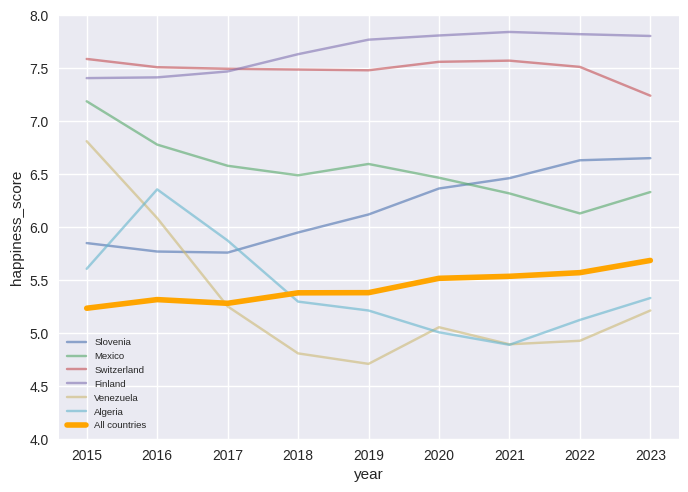

# Project of Data Visualization (COM-480)

| Student's name     | SCIPER |
| ------------------ | ------ |
| Matthieu Burguburu | 271837 |
| Marta Knežević     | 353739 |
| Vinko Sabolčec     | 353591 |

[Milestone 1](#milestone-1) • [Milestone 2](#milestone-2) • [Milestone 3](#milestone-3)

## Milestone 1 (7th April, 5pm)

**10% of the final grade**

*(max. 2000 characters per section)*

### Dataset

The dataset we have chosen to create visualizations for is the one supporting the “World Happiness Report”.
The World Happiness Report is a publication that measures the subjective well-being of individuals across countries and regions. We source it from the Kaggle dataset [World Happiness Report up to 2022](https://www.kaggle.com/datasets/mathurinache/world-happiness-report), but the report itself is built using life evaluations from the Gallup World Poll.

The dataset contains information about countries’ happiness score over the years 2015 to 2022, and is dependent on the following additional measures: GDP per capita, healthy life expectancy, social support, freedom to make life choices, generosity as well as corruption. Furthermore, the newest [2023 World Happiness Report](https://worldhappiness.report/ed/2023/) was added to the dataset so that the information is as new and complete as possible. 
Another dataset we are using for the project contains information about neighbouring countries and is available on [Country Borders](https://github.com/geodatasource/country-borders).

#### Cleaning and preprocessing

Due to the fact that the world happiness report varies from one year to another in terms of both countries and measured scores, the number of countries in the reports is variable. The dataset cleaning process was adapted from a [Kaggle notebook](https://www.kaggle.com/code/htester/exploratory-data-analysis). Countries that have changed their name in the period 2015-2023 have been renamed to the newest official name (e.g. Czech Republic to Czechia, Turkey to Turkiye, etc.). Region names for each country were added to the dataset.

Additional preprocessing of the Country Borders dataset, in terms of extracting only countries that occur in the World Happiness Report datasets, has to be done.

### Problematic

If you ask people whether they are happy, they probably can answer you quite easily. However, if you ask them why they are happy or not, they would have a more difficult time answering.

Creating interesting visualizations of the data in the report can be extremely useful in helping people to better understand and highlight the differences in happiness levels between countries and regions, as well as the factors and potential events that contribute to happiness.

For ordinary people, it may shed light on factors that they were unaware of, that may affect their lives greatly. It may make them grateful for what they have that others don’t, or make them aware of unjust inequalities.

It also provides valuable insights into the factors that contribute to happiness and offers politicians useful guidance on how to improve the well-being of their citizens.

### Exploratory Data Analysis

After cleaning the datasets, the 2015-2023 dataset consists of the happiness score for more than 130 countries each year and the 2023 dataset consists of happiness score, GDP, perception of social support, healthy life expectancy, perception of freedom, generosity and perception for 137 countries. In the dataset, the majority of the countries are present and this is important for the visualization we plan to do.

The happiness scores in each year follow approximately normal distribution. Mean and the median of the happiness score in all the years is 5.44. The distribution of measured scores (generosity, perception of corruption, etc.) is generally skewed. Among countries, both positive and negative trends are observed, as shown on Figure 1. Overall, there is a positive trend in the happiness score among all countries in the period 2015-2023, with the median happiness score 5.23 in 2015 and 5.68 in 2023.

*Figure 1. Happiness trends over 2015-2023 period*

Numbers of countries in the World Happiness report 2023 for each of the 10 regions vary from 2 (in North America and Australia and New Zealand) to 33 (in Sub-Saharan Africa). Out of all the regions, Australia and New Zealand is the “happiest” with median happiness score 7.11 and Southern-Asia and Sub-Saharan Africa are the “unhappiest” with median happiness score 4.36 and 4.43 respectively. Scatter plots are observed and they show positive correlation between factors GDP, social support, freedom, life expectancy and happiness score. Negative correlation is observed with perception of corruption and happiness score, while no apparent correlation is observed with generosity and happiness score.

*Figure 2. Histogram of the happiness score for the 2023 dataset*

*Figure 3. Happiness score box-plot per region for the 2023 dataset*

More figures can be found in the Jupyter Notebook `Milestone1\EDA.ipynb`.

### Related work

We found some existing visualizations of data from the World happiness report.

Majority of visualizations include 2D graphs which depict correlation among various factors and happiness scores. 
Some of existing work in that field is: [*Changing World Happiness* by World Happiness Report](https://worldhappiness.report/ed/2019/changing-world-happiness/) and [*Explore the 2017 World Happiness Report data via Tableau* by World Happiness Report](https://worldhappiness.report/news/explore-the-2017-world-happiness-report-data-via-tableau/).

Some of the more advanced and interactive visualizations made can be found on [*These are the happiest countries in the world* by nature](https://www.nature.com/nature-index/news-blog/data-visualization-these-are-the-happiest-countries-world-happiness-report-twenty-nineteen), [*Team 13 - Data Visualization Final Project (World Happiness)* on YouTube](https://www.youtube.com/watch?v=3jAP0pScVVM)
and [World Happiness Report Data Dashboard](https://worldhappiness.report/data/).

Existing work focuses on visualizing data from the world happiness report of one year. Furthermore, there are many available visualizations which group countries by region.

Based on our knowledge, there is no work that visualizes changes over the time on geographical maps. We will provide an interactive map visualization over the period 2015-2023.

Moreover, what makes our project original is interactive visualization of the happiness score for each country not only as part of the region or grouped by region, but in connection with neighboring countries on a graph.

## Milestone 2 (7th May, 5pm)

**10% of the final grade**

## Milestone 3 (4th June, 5pm)

**80% of the final grade**

## Late policy

- < 24h: 80% of the grade for the milestone
- < 48h: 70% of the grade for the milestone

